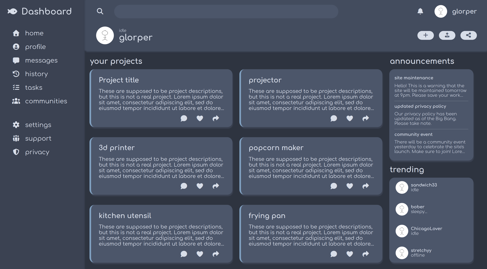

# Admin dashboard

The goal of this project was to make and style an admin dashboard. Most of it was done with CSS Grid but I also used Flexbox. 

## Features
- Responsive layout
- Highlights on hover (left sidebar and top buttons)
- Looks nice (I tried www)

## Thanks
- Colors are from the [Nord theme](https://www.nordtheme.com/)
- Icons are from [FontAwesome](https://fontawesome.com/)
- Font is called Comfortaa

## View it live!
Check right sidebar for the link.

## wip?
Maybe in the future:
- Light/dark mode
- Hover animations 
- An actual backend

If you made it this far you deserve an ice cream. Have a nice day! 🍨